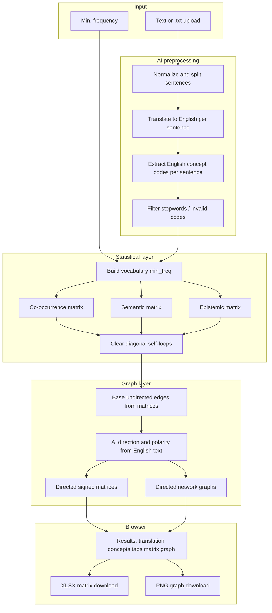
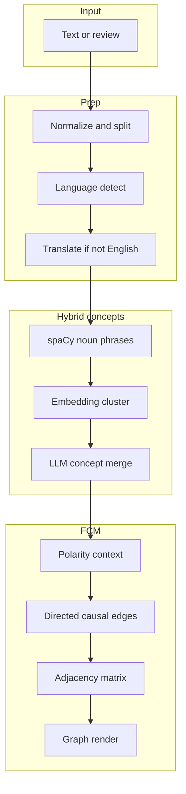

# Sementic Analysis Tool — End-to-end flow

This document describes how data moves through the **web application** from raw text to matrices, directed networks, and downloads. For the statistical definitions of each analysis, see [METHODS.md](METHODS.md).

**Version:** v0.00001

---

## Overview

Sementic turns qualitative text (any language) into **English thematic concept codes**, builds three **concept × concept** analyses, then uses AI again to assign **direction** and **polarity** to each link. Results are shown as interactive graphs, signed asymmetric matrices, and optional XLSX / PNG exports.

**Unit of analysis:** one sentence = one stanza.

**Requirements:** `OPENAI_API_KEY` (and optionally `OPENAI_MODEL`) in `.env` locally or in Railway variables.

---

## High-level pipeline



---

## Step 1 — User input (frontend)

| Action | Detail |
|--------|--------|
| Paste text | Textarea; minimum 20 characters |
| Upload file | `.txt` / plain text read into the textarea |
| Min. frequency | Concepts must appear at least this many times to enter the vocabulary (default: 0) |
| **Analyze** | `POST /api/analyze` with `FormData`: `text`, `min_freq` |

On submit, the UI shows a loading state and disables download buttons until the response returns.

---

## Step 2 — Text normalization

**Module:** `preprocess.py`

1. Unicode normalization and quote cleanup.
2. Split into sentences on `.`, `!`, `?`, `…`.
3. Sentence count and order are preserved for all later steps.

---

## Step 3 — English translation (AI)

**Module:** `ai_preprocess.py` → `translate_sentences_to_english`

- Each source sentence is translated to **English** in order.
- Batches are small (≤18 sentences) to avoid the model dropping lines.
- On count mismatch: one retry, then per-sentence fallback.
- Output: `english_sentences[]` (shown in the UI under **English translation**).

All later coding and relation inference use this English text.

---

## Step 4 — Thematic concept extraction (AI)

**Module:** `ai_preprocess.py` → `extract_concepts_with_ai`

- OpenAI receives the **English** sentences (joined for the prompt).
- Returns JSON: one list of **thematic concept labels** per sentence (Title Case constructs, e.g. `Brand Trust`, `Social Proof`).
- Blocklist removes grammar fragments; labels are normalized to Title Case codebook style.
- Output: `concepts_by_sentence[][]` (aligned with sentence index).

Example:

```json
[
  ["Brand Trust", "Social Proof", "Recommendations"],
  ["Word of Mouth", "Reviews"]
]
```

---

## Step 5 — Vocabulary and three matrices

**Module:** `analyses.py` → `run_all_analyses_from_sentences`

1. **Vocabulary:** count concepts across sentences; keep those with frequency ≥ `min_freq`.
2. Build three symmetric statistical matrices (diagonal forced to **0** — no self-loops):

| Key | What it measures |
|-----|------------------|
| `cooccurrence` | How often two concepts appear in the **same sentence** |
| `semantic` | **TF‑IDF** profile similarity (cosine) across sentences |
| `epistemic` | ENA-style co-activation + **lag** across consecutive sentences, then **centering** |

At this stage, matrices are **undirected** and (for co-occurrence / semantic) non-negative weights on off-diagonal cells.

---

## Step 6 — Base graphs

**Module:** `graph.py` → `graphs_from_matrices`

- Off-diagonal pairs only (`i ≠ j`).
- Edge inclusion rules differ by analysis (thresholds, caps for semantic / epistemic).
- Produces `nodes` and `edges` with statistical **weight** (polarity still neutral).

---

## Step 7 — Directed relations (AI)

**Module:** `ai_relations.py` → `annotate_graphs_with_relations`

For each analysis tab, every concept pair that has a graph edge is sent to OpenAI with the **full English text** and analysis context.

| Field | Values | Meaning |
|-------|--------|---------|
| **direction** | `a_to_b` | A → B in discourse / logic |
| | `b_to_a` | B → A |
| | `mutual` | Reciprocal A ↔ B (two directed edges) |
| **polarity** | `positive` | Supportive / aligned link (green) |
| | `negative` | Tension / opposition (red, weight × **−1**) |

Defaults if a pair is missing from the model response: `mutual`, `positive`.

**Signed weight:** `signed_weight = weight × (+1 | −1)`

**Matrices** are rebuilt as **asymmetric**: only the cell matching the arrow direction is filled (mutual fills both `(i,j)` and `(j,i)`).

---

## Step 8 — API response and UI

**Endpoint:** `POST /api/analyze` → JSON

| Field | Use |
|-------|-----|
| `english_sentences` | Translated lines in Concepts panel |
| `concepts_by_sentence` | English codes per sentence |
| `concept_frequency` | Top concept counts |
| `matrices` | Per-tab signed matrix (`labels`, `values`) |
| `graphs` | Per-tab `nodes`, `edges` (with `direction`, `polarity`, `signed_weight`) |

**Frontend** (`static/app.js`):

- Tabs: Co-occurrence / Semantic / Epistemic
- **vis-network** graph: arrows by direction; green / red dashed by polarity
- Matrix table: negative cells highlighted in red
- **Download XLSX** → `POST /api/download/xlsx` for the active matrix
- **Download graph** → PNG from the canvas (client-side)

---

## OpenAI call summary (typical web run)

| Stage | Calls (approx.) |
|-------|------------------|
| Translation | ⌈sentences / 18⌉ batches (+ retries / fallbacks) |
| Concept coding | 1 per analyze |
| Relation inference | ⌈edges / 24⌉ per analysis type × 3 types |

Long texts mean more latency and API usage.

---

## Optional CLI path (no AI)

**Module:** `main.py`

```bash
python main.py -i your_text.txt -o output --min-freq 0
```

- Uses **tokenization** only (`preprocess.tokens_by_sentence`), not translation or AI concepts.
- Writes three **XLSX** files under `output/` (gitignored).
- Does **not** run relation inference or the web UI pipeline.

---

## Configuration

| Variable | Role |
|----------|------|
| `OPENAI_API_KEY` | Required for web analyze |
| `OPENAI_MODEL` | Optional (default `gpt-4o-mini`) |
| `OPENAI_BASE_URL` | Optional custom API base |

Copy `.env.example` → `.env` for local development.

---

## Error handling (HTTP)

| Code | Typical cause |
|------|----------------|
| 400 | Text shorter than 20 characters |
| 422 | No sentences, empty vocabulary, or no valid concepts |
| 503 | Missing API key |
| 502 | OpenAI / translation / relation inference failure |

---

## Repository map (flow-related)

| Path | Role in flow |
|------|----------------|
| `app.py` | HTTP API, orchestrates pipeline |
| `ai_preprocess.py` | Translation + concept extraction |
| `ai_relations.py` | Direction + polarity on edges |
| `analyses.py` | Three matrices + self-loop clearing |
| `graph.py` | Matrix → base graph |
| `preprocess.py` | Sentence split, stopwords, CLI tokens |
| `static/` | Web UI |
| `docs/METHODS.md` | Mathematical detail per analysis |

---

## FCM pipeline (`pipeline=fcm`)

Parallel to STAT-3NET. Selected in the UI **PIPELINE → FCM** or via `pipeline=fcm` on analyze endpoints.



**Modules:** `fcm_service.py`, `lang_detect.py`, `concept_hybrid.py`, `fcm_inference.py`, `fcm_matrix.py`

**Response fields:** `pipeline`, `language`, `review_tone`, `concepts`, `edges`, `matrix`, `graph`

---

## Related documents

- [METHODS.md](METHODS.md) — formulas and interpretation of each matrix type  
- [README.md](../README.md) — setup, deploy, and project layout  
