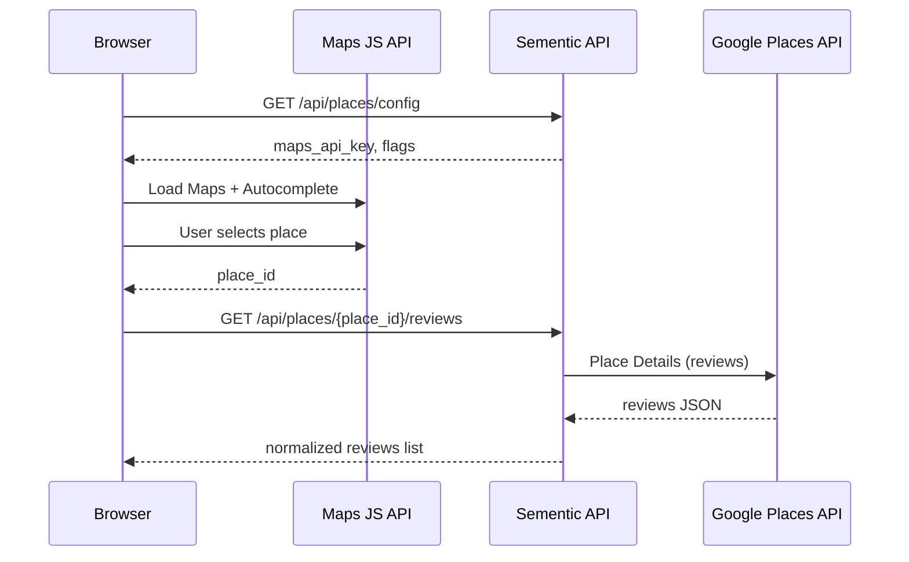

# Google Places integration

**Pick a place** → **fetch reviews** (max 5 texts from Google) → **Analyze all reviews** runs the full Sementic pipeline **once per review** (separate results).

## Environment variables

| Variable | Required | Purpose |
|----------|----------|---------|
| `GOOGLE_MAPS_API_KEY` | Yes (for UI) | Maps JavaScript API + Places Autocomplete in the browser |
| `GOOGLE_PLACES_API_KEY` | No | Server-side Place Details / reviews; defaults to `GOOGLE_MAPS_API_KEY` |

Add to `.env` locally or Railway variables.

## Google Cloud setup

1. Create or open a project in [Google Cloud Console](https://console.cloud.google.com/).
2. Enable APIs:
   - **Maps JavaScript API**
   - **Places API** (New) — recommended
   - **Places API** (legacy) — used as fallback if the new API fails
3. Create an API key.
4. Restrict the key (recommended):
   - **Application restrictions:** HTTP referrers for local dev (`http://127.0.0.1:8000/*`, `http://localhost:8000/*`) and your production domain.
   - **API restrictions:** Maps JavaScript API, Places API.
5. For server calls, you may use the same key or a separate key with IP restriction (Railway egress).

## Flow



## API endpoints

### `GET /api/places/config`

Returns whether keys are configured and the **browser** Maps API key.

### `GET /api/places/{place_id}/reviews`

Fetches place metadata and review texts. Response shape:

```json
{
  "place_id": "ChIJ...",
  "name": "Example Café",
  "address": "…",
  "rating": 4.3,
  "user_ratings_total": 120,
  "google_maps_uri": "https://maps.google.com/...",
  "reviews": [
    {
      "author": "…",
      "rating": 5,
      "text": "…",
      "relative_time": "2 weeks ago",
      "published_at": "2025-01-01T12:00:00Z"
    }
  ],
  "review_count": 5,
  "source": "places_v1"
}
```

Google typically returns **up to five** reviews per place.

## Code layout

| File | Role |
|------|------|
| `google_places.py` | Places API (New) + legacy fallback |
| `app.py` | `/api/places/*` routes |
| `static/places.js` | Map, autocomplete, review list UI |
| `static/index.html` | “Google Places” section |

### `POST /api/places/{place_id}/analyze-reviews`

Form field: `min_freq` (default 0).

1. Fetches place reviews (same 5-review Google limit).
2. For each review with text ≥ 20 characters, calls `run_sementic_analysis()` (same as `/api/analyze`).
3. Returns one analysis object per review (skipped entries include `reason`).

**Note:** 5 reviews × full AI pipeline can take **several minutes** and many OpenAI calls.

## UI

After reviews load, click **Analyze all reviews**. Each review opens in a collapsible card with graphs, matrices, and XLSX download.

## Optional: manual analyze

Paste a single review into the main textarea and use **Analyze** — same pipeline, one document.
